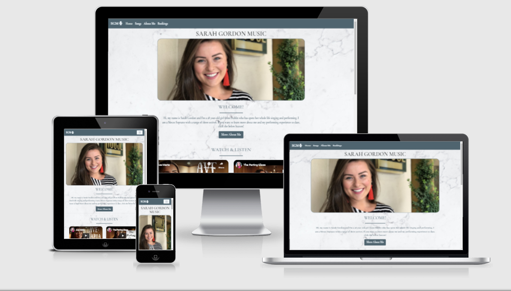
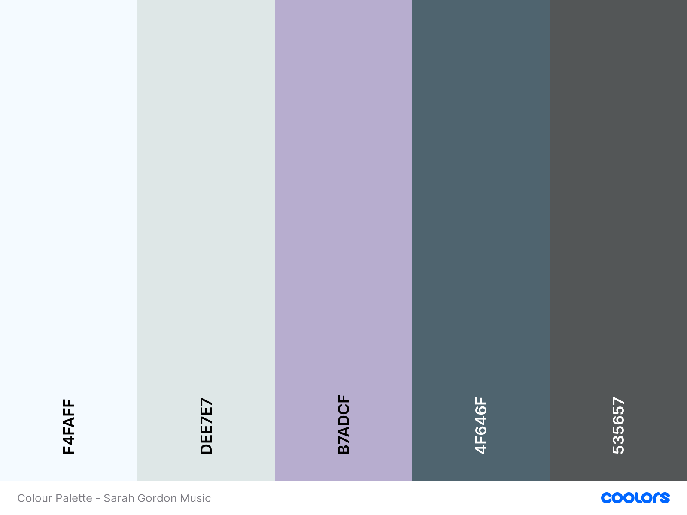

# **SARAH GORDON MUSIC**

[View live website here!](https://yusuffrih.github.io/Sarah-Gordon-Music/) 

## **Contents**
* User Experience - UX
    * Project Goal
    *User Goals
    * User Stories
    * Site Owner Goals
    * User Requirements & Expectations
    * Design Decisions
        * Fonts 
        * Icons
        * Colours
        * Images
        * Wireframes
* Features
    * Features that have been developed
    * Features to Implement
* Technologies Used
* Testing
* Bugs
* Deployment
* Credit

## **User Experience (UX)**

### Project Goal

*The goal for this project is to offer a beautiful website that will quickly offer it's users an clear insight into the service being provided and the quality of that service that can be provided to them on their special day. Users will be able to easily make a customised booking*

### User Goals

* To easily contact the site owner to make a booking
* To find information about the site owner
* To read reviews from previous customer experiences
* To view the cost of the services provided
* To be able to find the site owner’s social media pages
* To view a list of songs available to be sung at the wedding
* To view other projects that the site owner has worked on such as the live studio covers
* To see a sample of songs that will be sung if I pay for the service

### Site Owner Goals
As a site owner, I want:
* To receive bookings through my website.
* Communicate clearly to any prospective customers the cost of the service.
* To direct traffic to my social network pages and increase popularity, personal brand and my fanbase.
* To provide website users with a positive user experience.
* To advertise recent customers' positive experiences and increase referrals.
* Prospective customers to hear my voice as soon as possible and increase the likelihood of them making a booking. 
* To give perspective customers an insight into my performing career & achievements.
* To give prospective customers an idea of the kind of person I am as they will be sharing their wedding day with me.

### User Requirements & Expectations

#### Requirements:

* To be able to navigate the website using the navbar
* To be able to hear the voice of the singer and to see her performing, giving the user a shop window view of the service being offered
* To be able to make a booking through the website without any bugs or issues
* To be able to quickly contact the site owner
* For the content of the page to be displayed in a way that is readible and attractive and promotes a positive user experience

#### Expectations:
* The existence of a nav-bar which makes it easy to navigate the website pages
* To be able to read about previous customers' experiences in a testimonials page
* Information about the site owner is easily found and gives a good sense of their abilities. This is essential when paying for this kind of service
* All of the design elements display in a seamless manner
* Text and images are clearly readable and contrast against their background
* If using a screen-reader, the non-text elements have aria labels

### Design Decisions

When designing the website, I carried out some market research to see what the general design choices for similar websites. I carried out [Google](https://www.google.com) searches to see if I could find websites which provided a similar service that I could take some inspiration from. As part of my research, I found that there was generally a bright, almost Spring time theme which was sleek and attractive throughout. This was in keeping with the wedding theme.

#### Fonts:
When deciding the fonts that I would use on this website, I searched through [Google Fonts](https://fonts.google.com/) to see if there were any fonts that looked attractive and sleek and that would look good when styled. I chose the *Cormorant Garamond* font due to its nice, stylish look which I though suited the sites look and feel. I decided have used *Sans-Serif* as a backup font in case [Google Fonts](https://fonts.google.com/) does not work for any reason. 

#### Icons:

Icons used in this project were taken from [Font Awesome](https://fontawesome.com/). Icons were used to style the links to the social media pages and contact information in the footer. Some icons were also used to help illustrate the pricing section on the booking page.  

#### Colours:

When deciding what the colour scheme of my website would be, I did some research as mentioned above. I visited websites that had a similar purpose/goal to this one, Wedding Singers websites e.g. [https://weddingsinger.ie](https://weddingsinger.ie/). As previously mentioned, weddings generally tend to be themed with bright colours. This drove the decision around what the colour scheme would be, while being cognisant to keep it simple and not distracting from the content. 

I visited [Coolors](https://coolors.co/) to find a colour scheme which matched what I envisaged for the site. I chose the font colors and the background colors off of this palette.  

font colours:
* For the general font in the body of the website, I chose **#4F646F** as it contrasted against the light coloured background image
* H1: I chose **#535657**, a navy colour which contrasted very well with the white marbled background image I chose to have throughout the website. This differed from the rest of the text very slightly so as to give it increased importance to the site user.
* Navbar, Testimonial containers and buttons were given a **#4F646F** this was to keep in scheme with the font. All items inside these elements were given a colour of **#F4FAFF** to contrast and make it easily readable.

#### Images
*Follow the below links to view the relative images*

* The [hero image](assets/images/general/SGM.jpg) used was original and was uploaded from my hardrive.
* Testimonial [profile photos](assets/images/testimonials) and the [background image](assets/images/general/augustine-wong-li0iC0rjvvg-unsplash.jpg) of marbling that were used were obtained from [Unsplash](https://unsplash.com/).

#### Wireframes

* I used Balsamic to wireframe from the outset as it was a much more attractive approach that drawing by hand. There were some minor changes made using the software. Below are the final itterations of the wireframes I based the website off in png. format. 

1. Mobile Wireframes:

    * [Home](wireframes/mobile/home.png)
    * [Songs](wireframes/mobile/songs.png)
    * [About Me](wireframes/mobile/aboutme.png)
    * [Bookings](wireframes/mobile/bookings.png)

2. Tablet Wireframes:

    * [Home](wireframes/tablet/home.png)
    * [Songs](wireframes/tablet/songs.png)
    * [About Me](wireframes/tablet/aboutme.png)
    * [Bookings](wireframes/tablet/bookings.png)

3. Desktop Wireframes:

    * [Home](wireframes/desktop/home.png)
    * [Songs](wireframes/desktop/songs.png)
    * [About Me](wireframes/desktop/aboutme.png)
    * [Bookings](wireframes/desktop/bookings.png)

4. Wireframesof Testimonials page not implemented:

    * [Mobile](wireframes/mobile/testimonials.png)
    * [Tablet](wireframes/tablet/testimonials.png)
    * [Desktop](wireframes/desktop/testimonials.png)

## **Features**

### Features Implemented

* A beautiful and effective navigation through a navbar across each of the pages on the site.  
* A booking form which allows the prospective customer to contact the site owner easily. 
* Links to the site owners social media pages via slick Font Awesome icons. This is important as the site owner has a lot of content here which will give the prospective customers an in-depth view of the quality of the service provided in addition to what is on the website.  
* The site owner's contact information i.e. telephone number and email. These are needed in case the site visitor wants to contact the site owner and not make a booking. These are also displayed with Font Awesome icons. 
* A beautiful hero image of the site owner across the home page giving the site visitors positive emotions from the moment they land on the page. 
* Youtube video of the site owner displayed on the home page so that the site visitors can instantly see the service they will be paying for. 
* Audio file teasers of the music that will be sung at their weddings. 
* Responsive, mobile first layout that also looks great on tablets and desktops. This was done by using bootstrap's grid layout.
* Bootstrap buttons used to make a booking once the form is filled in. Bootstrap buttons to bring the site user to the 'Songs' & 'About Me' pages from the landing page. 
* An 'About Me' page which gives the potential customers an insight into what kind of person the site owner is as well as the previous work she has done as a singer and what the main achievements are.  
* A carousel to on the landing page to display the testimonials of the previous customers' positive experiences. 
* A pricing area that displays the prices of the different options available to perspective customers.

### Features Not Implemented
These features have not yet been implemented due to various reasons e.g. a lack of time

* Testimonials page - You will see from my wireframes that I originally planned on creating a Testimonials page to display the testimonials on one page, but I decided that it would be more efficient while also giving the user a better experience. 
* Modal - I wanted to have a modal appear when the user submitted their completed form. This would have been a nice piece of user feedback, however, due to scope of this project, I was not in a position to utilise it correctly. Modal code deleted from the Booking.html.  

## **Technologies**

The following technologies were used throughout the creation of the website: 

* [HTML 5](https://en.wikipedia.org/wiki/HTML) - HTML5 is a markup language I used for structuring and presenting content of my site.
* [CSS3](https://en.wikipedia.org/wiki/CSS) - A language I used to describe and style the presentation of the content written in HTML5.
* [Bootstrap 4](https://getbootstrap.com/docs/4.6/getting-started/introduction/)  - A front-end framework which assist me in creating responsive website design.  
* [Google Fonts](https://fonts.google.com/) - An open-source online library of thousands of fonts and icons that were free and easy to use.
* [Font Awesome](https://fontawesome.com/) - An open source online library of icons which I used for extra styling.
* [Balsamic](https://balsamiq.com/) - Software used to complete the wireframes. This was much easier than trying to draw.
* [Git](https://en.wikipedia.org/wiki/Git) - System used for version control.
* [GitHub](https://github.com/) - This is where my project repository was stored.
* [GitPod](https://gitpod.io/) - Open source, online workspace used to work on my project.
* [JQuery](https://en.wikipedia.org/wiki/JQuery) - Bootstrap depends on this to function fully.
* [Popper](https://cdnjs.com/libraries/popper.js/2.5.3) - Bootstrap depends on this to function fully.
* [W3 HTML Validator](https://validator.w3.org/) - Used to validate my code to ensure that there were no errors.
* [W3 CSS Validator](https://jigsaw.w3.org/css-validator/) - Used to validate my code to ensure that there were no errors. 
* [Microsoft Edge (Chromium) Developer Tools](https://docs.microsoft.com/en-us/microsoft-edge/devtools-guide-chromium/) - Used this 
* [Youtube Embedding](https://support.google.com/youtube/answer/171780?hl=en) - Used the Youtube embedding to copy code from Youtube to be able to display the videos on my site.
* [Coolors](https://coolors.co/) - Used this to generate a colour scheme that matched what I wanted for the site.
* [Lightohouse ](https://chrome.google.com/webstore/detail/lighthouse/blipmdconlkpinefehnmjammfjpmpbjk?hl=en) - Used to assess the level of accessibility, performance and correctness that was provided by the site.

## **Testing**

### User Story Testing

1. To be able to view the site on a desktop / laptop / tablet or mobile.
    * The website changes the way it is displayed in a seamless way. This makes it user friendly regardless of what size viewport the user is using.

2. To be able to quickly hear the voice of the site owner so that I can be well informed when deciding on whether to avail of the service.
    * The user need not go further than the landing page to be able to see and listen to the site owner singing. This gives the user a sense of the quality of the service immediately. They are they prompted, in both the navbar and the landing page content to go to the 'songs' page where they can here samples and watch Youtube videos.

3. To know what the details of the services that are on offer.
    * Once the user arrives at the landing page, they will see the navbar where they can find the 'Bookings' option. The user can access the booking page from the navbar where they will then see the packages and prices on offer.

5. To be able to see a sample list of songs that the site owner can sing at my wedding.
    * The user can see a 'Songs' page in the navbar. When they access this page, there is a list of sample songs that would typically be sung at weddings.

6. To hear from previous customers about their experiences.
    * Upon arriving at the landing page, the user will be prompted to scroll to the bottom of the page where they will find a carousel with musltiple testimonials from previous happy customers. 

7. To be able to easily contact the site owner to make a booking.
    * Upon landing at the landing page, the user will be see 'Bookings' in the navbar where they can go to make a booking through the fulling functioning form provided. 

8. To be able to make a special request for a song to be sung on my wedding day.
    * In the booking form, the site owner has added a text field prompting the user to add any specific song requests that they may have. 

9. To know about the site owner as they will be taking part in my wedding day.
    * The user will be able to read some information about the site owner in the 'Songs' page where the site owner has put up information about themselves as well as their performing experience and achievements. 

### Validator Testing

#### HTML Validator

The HTML validator used was [W3 HTML Validator](https://validator.w3.org/) 

Errors & Fixes:
1. Index.html
    * No errors found in this page of code. 

2. Songs.html 
    * Error: Attribute type not allowed on element audio at this point.
    * Fix:  add source element and move src, title and type attributes here. 

3. Aboutme.html
    * No errors found in this page of code.
4. Booking.html
    * Error 1: Bad value address for attribute type on element input.
    * Fix 1: change type attrivbute value to 'text'

    * Error 2: The first child option element of a select element with a required attribute, and without a multiple attribute, and without a size attribute whose value is greater than 1, must have either an empty value attribute, or must have no text content. Consider either adding a placeholder option label, or adding a size attribute with a value equal to the number of option elements.
    * Fix 2: Added an empty value attribute to the placeholder option 'Choose...'

#### CSS Validator

[W3 CSS Validator](https://jigsaw.w3.org/css-validator/) was the validator I used to ensure the CSS code did not contain errors. 

Errors & Fixes:

1. No errors found in CSS code

### Feature Testing:

1. A beautiful and effective navigation through a navbar across each of the pages on the site.  
    * Navigation bar worked well and took me to each of the desired pages. The nav bar was tested on each page as well.
2. A booking form which allows the prospective customer to contact the site owner easily. 
    * The booking form worked perfectly. All of the required attributes worked other that for the options field. 
3.  Links to the site owners social media pages via slick Font Awesome icons. This is important as the site owner has a lot of content here which will give the prospective customers an in-depth view of the quality of the service provided in addition to what is on the website.  
    * All of the social media link and and icons worked as desired from each individual page's footer. They all open in another tab in the browser.
4.  The site owner's contact information i.e. telephone number and email. These are needed in case the site visitor wants to contact the site owner and not make a booking. These are also displayed with Font Awesome icons. 
    * The information is dislayed for the site user to see and use manually as well as being functioning links to be clicked which will either call or email depending on which one you click. 
5. A beautiful hero image of the site owner across the home page giving the site visitors positive emotions from the moment they land on the page. 
    *  Upon arriving at the landing page, the user is greeted with a beautiful smiling image of the site owner. If the image does not load, there is still a background colour in place which fits with the colour scheme of the site.  
6. Youtube video of the site owner displayed on the home page so that the site visitors can instantly see the service they will be paying for. 
    * There are two Youtube videos that display on the landing page function well and are easily found
7. Audio file teasers of the music that will be sung at their weddings. 
    * The audio files all labelled and function correctly. The sound quality could be improved however as the recording were done on an iPhoneX and not a studio. 
8. Responsive, mobile first layout that also looks great on tablets and desktops. This was done by using bootstrap's grid layout.
    * After using the Bootstrap grid system, the website is fully responsive to all screen sizes.  
9. Bootstrap buttons used to make a booking once the form is filled in. Bootstrap buttons to bring the site user to the 'Songs' & 'About Me' pages from the landing page. 
    * All buttons used were bootstrap buttons and used bootstrap classes. They all were custome styled thereafter and carried out the desired functions.
10. An 'About Me' page which gives the potential customers an insight into what kind of person the site owner is as well as the previous work she has done as a singer and what the main achievements are. 
    * Upon arriving at the landing page, the user is greated with a welcome note by the site owner followed by a button which will take them to the 'About Me' page where they can see some information about the site owner.  
11. A carousel to on the landing page to display the testimonials of the previous customers' positive experiences. 
    * The user can see the testimonials carousel on the landing page which displays an image of the couple who are giving the testimonial, navigation buttons to go to the next/previous testimonial, the testimonial itself. All of this against a beautiful background container. 
13. A pricing area that displays the prices of the different options available to perspective customers.
    * When the user hits the landing page, the will be able to navigate to the Bookings page through the navbar where they will immediately see the pricing details above the booking form. 

### Lighthouse Testing

* Lighthouse was used to assess the level of accessibility, performance and correctness that was provided by the site. This generated a report based on how the page performed against these criteria. It was great to use as, based on the results of the test, I could see where the scores fell down which prompted me to try and improve on the website.  

The following are links to the PDF files of the results from Lighthouse testing: 

**Mobile**

* [Mobile - Home](testing/lighthouse_mobile/mobile-home.pdf)
* [Mobile - Songs](testing/lighthouse_mobile/mobile-songs.pdf)
* [Mobile - About Me](testing/lighthouse_mobile/mobile-aboutme.pdf)
* [Mobile - Bookings](testing/lighthouse_mobile/mobile-booking.pdf)

**Desktop**

* [Desktop - Home](testing/lighthouse_desktop/desktop-home.pdf)
* [Desktop - Songs](testing/lighthouse_desktop/desktop-songs.pdf)
* [Deskstop - About Me](testing/lighthouse_desktop/desktop-aboutme.pdf)
* [Desktop - Bookings](testing/lighthouse_desktop/desktop-bookings.pdf)

### Compatibility & Responsive Testing:

#### Devices

I tested the website's compatibility using the Microsoft Edge (Chromium) Developer Tools. The following devices were tested:
* Moto G4
* Iphone 4
* Galaxt S5
* Pixel 2
* Pixel 2XL
* Iphone 5/SE
* Iphone 6/7/8
* Iphone 6/7/8 Plus
* Iphone X
* Ipad
* Ipad pro
* Surface Duo
* Galaxy Fold

The compatibility testing was **successful on all devices**, giving the website an attractive look and feel as well as functionality on all. 

#### Browsers

I tested the website's compatibility using the Microsoft Edge (Chromium) Developer Tools. The following browsers were tested:

* Google Chrome
* Safari 
* Microsoft Edge
* Mozilla Firefox

The testing was **successful on all websites**, giving the website an equally attractive look and feel as well as functionality on all browsers. 

## Bugs

Below are some of the bugs that I came across throughout the development of the website:

### Resolved Bugs

**1.**

Bug: I could not figure out how to change the colour of the navigation items in the nav bar. 

Fix:  Went onto the chrome dev tools and began to investigate where the issue lay. I found the code that controlled the colour of the nav-items and then added this to my CSS. 

**2.**

Bug: I lost the controls on the testimonials carousel after I input the photos.

Fix: place the previous and next elements into the "carousel-inner" div

**3.**

Bug: 'Home' nav item on songs page was same colour as 'songs' when in the songs page

Fix: Removed the 'active' class from 'Home nav-item in the html code which gave it a different colour

**4.**

Bug: Options selector in form on bookings page was not being validated. 

Fix: added an empty value attribute to the placeholder option

**5.**

Bug: One of the testimonials was visible behind the rest of the carousel and you could see this as the next and previous buttons were pressed and the cards slid past.

Fix: Active class was placed in more than one of the testimonial carousel cards which caused the error. Removed from the extra carousel item.

**6.** 

Bug: The footer contact elements (email and phone number) were displaying well in certain screen sizes but then the icon would move to the next line. This did not look well. 

Fix: I input a couple of media queries which didn't stop it from happening but just made the overall look of the footer better when it did happen. 

### Unresolved Bugs

There were no bugs that I encountered that I did not resolve. I found Youtube and the resources that were available to us either by the Coding Institute or through slack or tutoring to be a really big help when problem solving. 

## Deployment

### Online

Of course, this project was built on GitPod and the repository hosted within Github. This meant that it was deployed in Github Pages. There were only a few easy steps involved when deploying the website to Github Pages. They are the following:

1. Open the browser
2. Search for Github
3. Sign-in using my Github account details
4. Go to repositories page
5. Open the relevant repository
6. Go to settings
7. Scroll until I get to Github pages section
8. Click into the sources section
9. Click into branches and select 'master'
10. Once master is selected, click save
11. Refresh page to see the confirmation of the deployment

### Cloning

To make a clone of the repository to your desktop and begin working on it locally, follow these steps:

1. Open the browser
2. Search for Github
3. Sign-in using my Github account details
4. Go to repositories page
5. Open the relevant repository
6. Click on the 'code' button beside the green 'GitPod' button
7. Paste the url provided
8. Open the desktop workspace
9. Choose the location from where you want to clone the repository
11. Paste in the url from step 7 into local path
10. Click clone
12. Enter

## **Credits**

### Code:

* Bootstrap - used for enhancing the responsiveness of the website through CSS and Script plug-ins
* Font Awesome - used for adding attractive icons into the site  
* Youtube - Embedded Youtube videos through copying the code 

### Resources

* Youtube - used Youtube to help me solve problems as I went through the development process
* Code Institute lecture videos - These were a great help to refer back to 
* Mentor sessions - Mentor provided great feedback on the ideas I had and then on the website itself when it was more tangible.
* Tutors - Tutors are a great resource to have on hand
* Slack - fellow student support is both useful and comforting
* W3 Schools - This website is a brilliant resource that I used on a very frequent basis.
* Coolors - Used this site to get a colour scheme which I liked for the website

### Images

* I used [Unsplashed](https://unsplash.com/) to get the [photos](https://github.com/Yusuffrih/Sarah-Gordon-Music/tree/master/assets/images/testimonials) for the testimonials and the [background photo](assets/images/general/augustine-wong-li0iC0rjvvg-unsplash.jpg)

* The [hero image](assets/images/general/SGM.jpg) is an original provided to me by the subject of the photo

### Acknowledgements

I would like to thank the following for all of the assistance throughout the development of this project:
* Code Institute Tutors
* My Mentor Ignatius for all of the great advice
* Everybody on the Slack community for always being on hand to answer any questions I had
*  My family

 

***This website is for educational purposes only!***  

